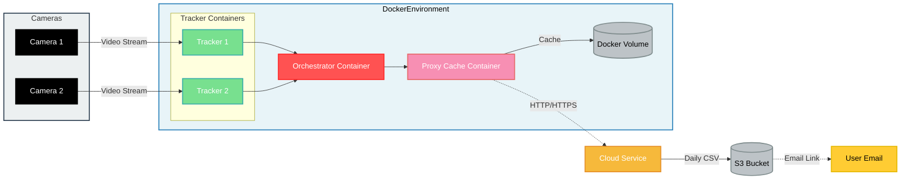

# Dullahan System Architecture and Workflow

## Table of Contents

1. [Overview](#overview)
2. [System Components](#system-components)
3. [Docker Architecture](#docker-architecture)
4. [Workflow Diagram](#workflow-diagram)
5. [Data Flow](#data-flow)
6. [Development Workflow](#development-workflow)

## Overview

The Dullahan project is a multi-platform video analysis system designed for Mac and Ubuntu. It leverages YOLO-based object detection to process multiple video streams in real-time. The system consists of three main components: Tracker, Proxy Cache, and Orchestrator, which work together to capture, process, and transmit video analysis data. The entire system is now containerized using Docker for improved consistency and easier deployment across different environments.

## System Components

1. **Tracker**

   - Processes video streams using YOLO-based object detection
   - Generates observations (e.g., crowd counts, object detection)
   - Exposes an HTTP API for data access
   - Note: The tracker module is based on the oaTracker repository

2. **Proxy Cache**

   - Manages network interruptions
   - Caches requests when the network is unavailable
   - Automatically resends cached requests when the network is restored

3. **Orchestrator**
   - Manages multiple Tracker instances
   - Coordinates data flow between Trackers and Proxy Cache
   - Optimizes system-wide performance

## Docker Architecture

The Dullahan system is now containerized using Docker, with each component running in its own container:

1. **Tracker Container**

   - Based on a Python image
   - Contains the YOLO model and video processing logic
   - Exposes an internal port for API access

2. **Proxy Cache Container**

   - Based on a Node.js image
   - Implements caching and network management logic
   - Communicates with the cloud service

3. **Orchestrator Container**

   - Based on a Python or Node.js image (depending on implementation)
   - Manages communication between Tracker and Proxy Cache containers
   - Handles system-wide coordination

4. **Docker Network**

   - A custom Docker network allows secure communication between containers
   - Isolates the Dullahan system from other Docker containers on the host

5. **Docker Volumes**
   - Used for persistent storage of configuration and cached data
   - Ensures data persistence across container restarts

## Workflow Diagram

## Data Flow

1. **Video Input**

   - Cameras (webcams or RTSP streams) provide video input to the Tracker containers

2. **Video Processing**

   - Tracker containers analyze video streams using YOLO-based object detection
   - Trackers generate observations (e.g., crowd counts, object detection)

3. **Data Aggregation**

   - The Orchestrator container collects data from multiple Tracker containers
   - The Orchestrator may perform additional processing or optimization

4. **Data Transmission**

   - The Orchestrator sends processed data to the Proxy Cache container
   - The Proxy Cache attempts to send data to the cloud service

5. **Caching and Retry**

   - If the network is unavailable, the Proxy Cache stores data in a Docker volume
   - The Proxy Cache periodically checks network connectivity
   - When the network is restored, cached data is sent to the cloud service

6. **Cloud Processing**
   - The cloud service processes the received data
   - Results are stored in an S3 bucket and made available to users

## Development Workflow

1. **Local Development**

   - Developers use Docker Compose for local development and testing
   - Each component can be developed and tested independently in its container

2. **Version Control**

   - Git is used for version control
   - Each component has its own directory in the repository

3. **Continuous Integration**

   - CI/CD pipeline builds Docker images for each component
   - Automated tests are run in a containerized environment

4. **Deployment**

   - Docker images are pushed to a container registry
   - Deployment scripts pull the latest images and update the running containers

5. **Monitoring and Logging**

   - Docker's built-in logging is used to collect logs from all containers
   - A centralized logging system aggregates logs for analysis

6. **Scaling**
   - Additional Tracker containers can be spawned to handle increased load
   - The Orchestrator container manages the dynamic scaling of Trackers

This Docker-based workflow ensures consistency across development, testing, and production environments, while also providing flexibility for scaling and managing the Dullahan system.
