# Dullahan System Architecture and Workflow

## Table of Contents

1. [Overview](#overview)
2. [System Components](#system-components)
3. [Hybrid Architecture](#hybrid-architecture)
4. [Workflow Diagram](#workflow-diagram)
5. [Data Flow](#data-flow)
6. [Development Workflow](#development-workflow)

## Overview

The Dullahan project is a multi-platform video analysis system designed for Mac and Ubuntu. It leverages YOLO-based object detection to process multiple video streams in real-time. The system consists of three main components: Tracker, Proxy Cache, and Orchestrator. The Tracker runs as a native Python application, while the Proxy Cache and Orchestrator are containerized using Docker for improved consistency and easier deployment across different environments.

## System Components

1. **Tracker**

   - Processes video streams using YOLO-based object detection
   - Generates observations (e.g., crowd counts, object detection)
   - Exposes an HTTP API for data access
   - Runs as a native Python application
   - Note: The tracker module is based on the oaTracker repository

2. **Proxy Cache**

   - Manages network interruptions
   - Caches requests when the network is unavailable
   - Automatically resends cached requests when the network is restored
   - Runs in a Docker container

3. **Orchestrator**
   - Manages multiple Tracker instances
   - Coordinates data flow between Trackers and Proxy Cache
   - Optimizes system-wide performance
   - Runs in a Docker container

## Hybrid Architecture

The Dullahan system uses a hybrid approach, combining a native Python application with Docker containers:

1. **Tracker (Native Python Application)**

   - Runs directly on the host system
   - Utilizes the system's GPU for YOLO-based object detection
   - Exposes a local port for API access

2. **Proxy Cache Container**

   - Based on a Node.js image
   - Implements caching and network management logic
   - Communicates with the cloud service

3. **Orchestrator Container**

   - Based on a Python or Node.js image (depending on implementation)
   - Manages communication between Tracker and Proxy Cache
   - Handles system-wide coordination

4. **Docker Network**

   - A custom Docker network allows secure communication between containers and the native Tracker application
   - Isolates the Dullahan system from other Docker containers on the host

5. **Docker Volumes**
   - Used for persistent storage of configuration and cached data
   - Ensures data persistence across container restarts

## Workflow Diagram

```mermaid
graph LR
    subgraph Cameras
        C1[Camera 1]
        C2[Camera 2]
    end

    subgraph HostSystem
        T[Tracker Python App]
    end

    subgraph DockerEnvironment
        O[Orchestrator Container]
        PC[Proxy Cache Container]
        V[(Docker Volume)]
    end

    Cloud[Cloud Service]
    S3[(S3 Bucket)]
    User[User Email]

    C1 -->|Video Stream| T
    C2 -->|Video Stream| T
    T --> O
    O --> PC
    PC -->|Cache| V
    PC -.->|HTTP/HTTPS| Cloud
    Cloud -->|Daily CSV| S3
    S3 -.->|Email Link| User

    classDef camera fill:#000000,stroke:#000000,stroke-width:2px,color:#ffffff;
    classDef tracker fill:#78e08f,stroke:#38ada9,stroke-width:2px,color:#ffffff;
    classDef orchestrator fill:#ff5252,stroke:#ff2a2a,stroke-width:2px,color:#ffffff;
    classDef proxy fill:#f78fb3,stroke:#e66767,stroke-width:2px,color:#ffffff;
    classDef storage fill:#bdc3c7,stroke:#7f8c8d,stroke-width:2px,color:#000000;
    classDef cloud fill:#f6b93b,stroke:#e58e26,stroke-width:2px,color:#ffffff;
    classDef user fill:#ffcc33,stroke:#e5b800,stroke-width:2px,color:#000000;

    class C1,C2 camera;
    class T tracker;
    class O orchestrator;
    class PC proxy;
    class V,S3 storage;
    class Cloud cloud;
    class User user;

    style Cameras fill:#ecf0f1,stroke:#2c3e50,stroke-width:2px;
    style HostSystem fill:#e8f4f8,stroke:#2980b9,stroke-width:2px,color:#000000;
    style DockerEnvironment fill:#e8f4f8,stroke:#2980b9,stroke-width:2px,color:#000000;
```

## Data Flow

1. **Video Input**

   - Cameras (webcams or RTSP streams) provide video input to the Tracker application

2. **Video Processing**

   - The Tracker application analyzes video streams using YOLO-based object detection
   - Tracker generates observations (e.g., crowd counts, object detection)

3. **Data Aggregation**

   - The Orchestrator container collects data from the Tracker application
   - The Orchestrator may perform additional processing or optimization

4. **Data Transmission**

   - The Orchestrator sends processed data to the Proxy Cache container
   - The Proxy Cache attempts to send data to the cloud service

5. **Caching and Retry**

   - If the network is unavailable, the Proxy Cache stores data in a Docker volume
   - The Proxy Cache periodically checks network connectivity
   - When the network is restored, cached data is sent to the cloud service

6. **Cloud Processing**
   - The cloud service processes the received data
   - Results are stored in an S3 bucket and made available to users

## Development Workflow

1. **Local Development**

   - Developers use a combination of native Python development for the Tracker and Docker Compose for the Orchestrator and Proxy Cache
   - Each component can be developed and tested independently

2. **Version Control**

   - Git is used for version control
   - Each component has its own directory in the repository

3. **Continuous Integration**

   - CI/CD pipeline builds Docker images for the Orchestrator and Proxy Cache components
   - Automated tests are run for both the native Tracker application and the containerized components

4. **Deployment**

   - Docker images for Orchestrator and Proxy Cache are pushed to a container registry
   - Deployment scripts pull the latest images and update the running containers
   - The Tracker application is deployed as a native Python application on the host system

5. **Monitoring and Logging**

   - Docker's built-in logging is used to collect logs from containerized components
   - Custom logging is implemented for the native Tracker application
   - A centralized logging system aggregates logs from all components for analysis

6. **Scaling**
   - Additional Tracker instances can be spawned on separate host systems if needed
   - The Orchestrator container manages the coordination between multiple Tracker instances

This hybrid workflow combines the benefits of native application performance for the Tracker with the consistency and ease of deployment provided by Docker for the other components. It ensures flexibility in development, testing, and production environments while allowing for efficient scaling and management of the Dullahan system.
