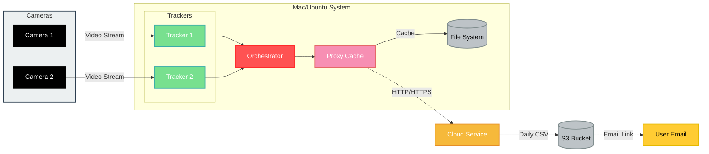

# Dullahan System Architecture

## Table of Contents

1. [Overview](#overview)
2. [System Components](#system-components)
3. [Workflow Diagram](#workflow-diagram)
4. [Data Flow](#data-flow)

## Overview

The Dullahan project is a multi-platform video analysis system designed for Mac and Ubuntu. It leverages YOLO-based object detection to process multiple video streams in real-time. The system consists of three main components: Tracker, Proxy Cache, and Orchestrator, which work together to capture, process, and transmit video analysis data.

## System Components

1. **Tracker**

   - Processes video streams using YOLO-based object detection
   - Generates observations (e.g., crowd counts, object detection)
   - Exposes an HTTP API for data access
   - Note: The tracker module is a clone of the oaTracker repository

2. **Proxy Cache**

   - Manages network interruptions
   - Caches requests when the network is unavailable
   - Automatically resends cached requests when the network is restored

3. **Orchestrator**
   - Manages multiple Tracker instances
   - Coordinates data flow between Trackers and Proxy Cache
   - Optimizes system-wide performance

## Workflow Diagram

## Data Flow

1. **Video Input**

   - Cameras (webcams or RTSP streams) provide video input to the Trackers

2. **Video Processing**

   - Trackers analyze video streams using YOLO-based object detection
   - Trackers generate observations (e.g., crowd counts, object detection)

3. **Data Aggregation**

   - The Orchestrator collects data from multiple Trackers
   - The Orchestrator may perform additional processing or optimization

4. **Data Transmission**

   - The Orchestrator sends processed data to the Proxy Cache
   - The Proxy Cache attempts to send data to the cloud service

5. **Caching and Retry**

   - If the network is unavailable, the Proxy Cache stores data locally
   - The Proxy Cache periodically checks network connectivity
   - When the network is restored, cached data is sent to the cloud service

6. **Cloud Processing**
